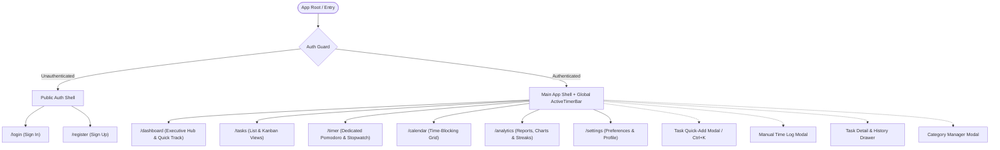
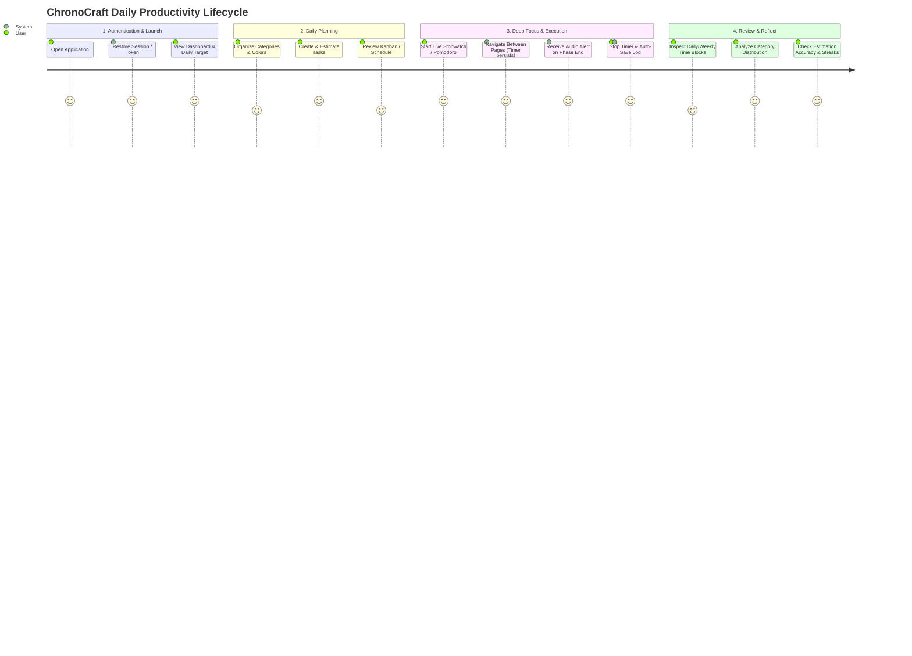
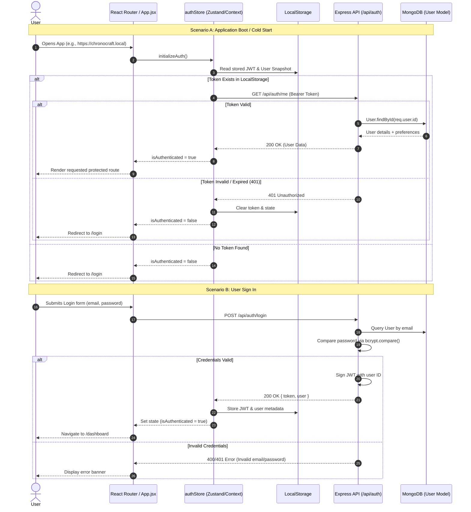
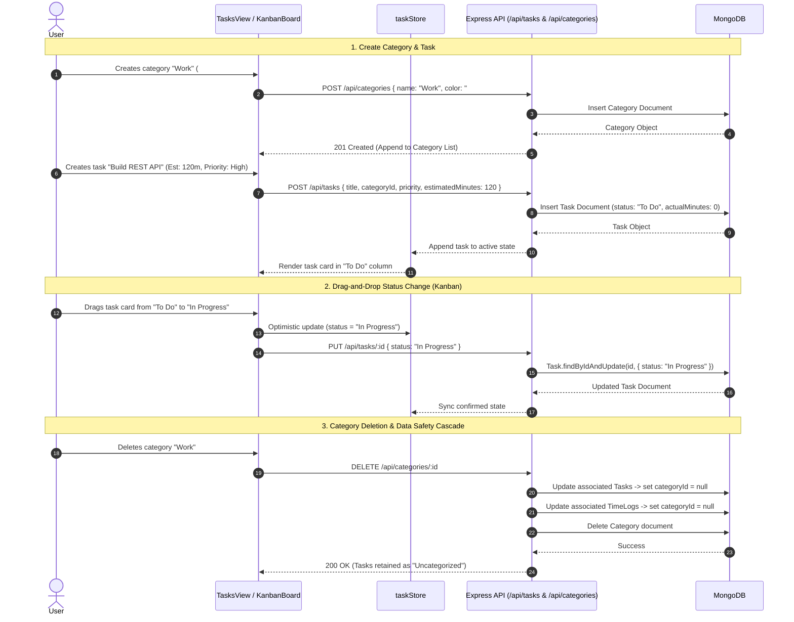
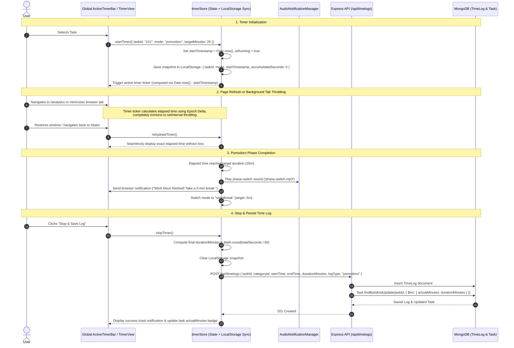
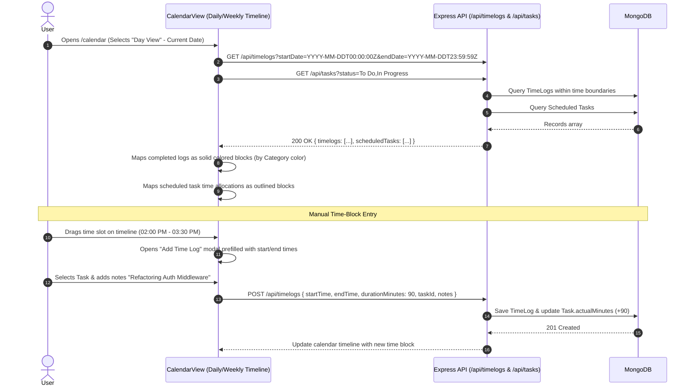
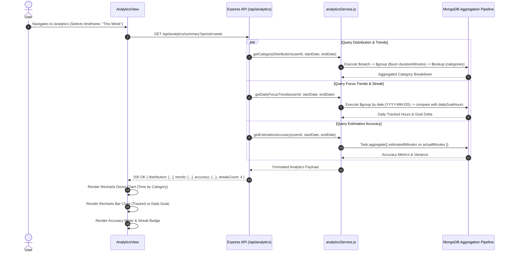
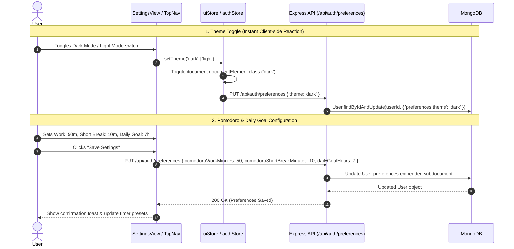
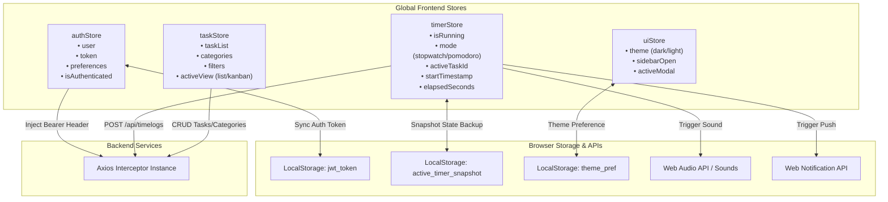

# Application Flow & User Journey Document: ChronoCraft

**Project Name:** ChronoCraft (Personal Time Management Suite)  
**Document Version:** 1.0.0  
**Date:** August 2026  
**Reference Documents:** [Product Requirement Document (PRD)](./prd.md) | [System Architecture Document](./architecture.md)  
**Tech Stack:** MERN (MongoDB, Express.js, React.js with Vite, Node.js, Tailwind CSS)

---

## 1. Application Sitemap & Routing Architecture

ChronoCraft is architected as a single-page application (SPA) with clear route-level access control, persistent global UI shells, and modal overlays.

### 1.1 Route Directory & Permissions

| Route Path | View / Component | Access Level | Description |
| :--- | :--- | :--- | :--- |
| `/login` | `LoginView` | Public | Email/Password authentication & token issuance |
| `/register` | `RegisterView` | Public | Account creation with default preferences |
| `/` or `/dashboard` | `DashboardView` | Protected | Daily summary ring, quick-start timer, upcoming tasks |
| `/tasks` | `TasksView` | Protected | Task management via List or Kanban board |
| `/timer` | `FocusTimerView` | Protected | Deep focus room (large Pomodoro/Stopwatch wheel) |
| `/calendar` | `CalendarView` | Protected | Daily/Weekly time-blocking and actual vs planned grid |
| `/analytics` | `AnalyticsView` | Protected | Category distribution donut, focus trends, accuracy |
| `/settings` | `SettingsView` | Protected | Pomodoro intervals, daily target hours, theme toggle |
| `*` | `NotFoundView` | Public | 404 fallback page redirecting to `/dashboard` or `/login` |

---

## 2. Core User Journey Map

---

## 3. End-to-End Feature Flows & Sequence Diagrams

### 3.1 Authentication & Session Rehydration Flow

Handles user onboarding, login token generation, local persistence, route protection, and automatic session restoration.

---

### 3.2 Category & Task Management Flow

Enables creating categories with color coding, organizing tasks via List or Kanban views, updating task statuses, and preserving historical log data upon deletion.

---

### 3.3 Live Time Tracking & Timer Engine Flow (Drift-Resilient)

This flow details how the client guarantees millisecond-accurate time tracking resilient to browser background tab throttling, route changes, and tab closures, finishing with database log persistence and task duration aggregation.

---

### 3.4 Time-Blocking & Calendar Interaction Flow

Allows users to inspect daily/weekly timeline grids, view completed time logs mapped directly to hours of the day, and schedule future task blocks.

---

### 3.5 Analytics & Productivity Reflection Flow

Aggregates productivity data on demand using MongoDB aggregation pipelines to visualize category time distribution, daily trends vs goals, and estimation accuracy.

---

### 3.6 Settings & Preference Customization Flow

Allows users to personalize their focus work session lengths, target working hours, and theme styling.

---

## 4. Global State Architecture & Synchronization

The application coordinates four modular frontend stores to maintain high responsiveness and state continuity across routes:

---

## 5. Error Handling, Edge Cases & Resilience Flows

### 5.1 Token Expiry & Automatic Logout
* **Trigger:** API returns `401 Unauthorized` on any protected request due to expired JWT.
* **Flow:** Axios response interceptor catches `401`, triggers `authStore.logout()`, removes the token from `localStorage`, cancels any active timer snapshot, and redirects the user to `/login` with a session-expired notification.

### 5.2 Network Outage During Timer Stop
* **Trigger:** User stops a timer while internet connectivity is temporarily interrupted.
* **Flow:**
  1. The client catches the network failure during `POST /api/timelogs`.
  2. The timer store retains the log entry in a `pending_logs` queue inside `localStorage`.
  3. UI displays a warning banner: *"Network offline. Log saved locally and will sync when connection is restored."*
  4. An online event listener (`window.addEventListener('online')`) automatically retries syncing pending logs to the backend.

### 5.3 Background Tab Throttling & Zero Clock Drift
* **Trigger:** Modern browsers throttle `setInterval` callbacks to once per minute when tabs are placed in the background.
* **Mitigation:**
  - Timer calculations never increment counters by step ticks.
  - The elapsed time is always calculated dynamically as:
    $$\text{Elapsed Time} = \text{accumulatedSeconds} + \left\lfloor \frac{\text{Date.now()} - \text{startTimestamp}}{1000} \right\rfloor$$
  - When the tab regains focus, the next tick instantly computes the exact current elapsed time with zero drift.

---

## 6. Screen Transition & Interaction Matrix

| Current Screen | Action / User Event | Target Screen / State Change | Global Side Effects |
| :--- | :--- | :--- | :--- |
| **Any Screen** | Clicks "Start Timer" on any task card | Starts timer in `ActiveTimerBar` | Snapshot saved to `localStorage`; timer runs across all routes |
| **Any Screen** | Presses `Ctrl + K` or `Cmd + K` | Opens `QuickAddModal` | Focus set to Task Title input field |
| **Dashboard** | Clicks "Go to Focus Room" | Navigates to `/timer` | Mounts full-screen Pomodoro/Stopwatch focus interface |
| **Tasks View** | Switches view toggle (List $\leftrightarrow$ Kanban) | Toggles component view | Updates `taskStore.activeView` |
| **Tasks View** | Drags card to "Completed" column | Moves column; task status $\to$ `Completed` | Dispatches `PUT /api/tasks/:id`; triggers success badge |
| **Calendar** | Clicks an empty hour slot | Opens `ManualLogModal` | Prefills start/end times in modal |
| **Analytics** | Changes filter dropdown (e.g. "This Month") | Refreshes chart displays | Triggers aggregation queries with new date boundaries |
| **Settings** | Changes Pomodoro work duration | Updates preset timers | Updates User preferences in DB and `authStore` |
