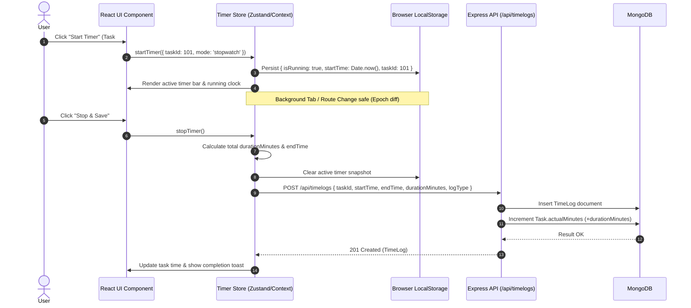
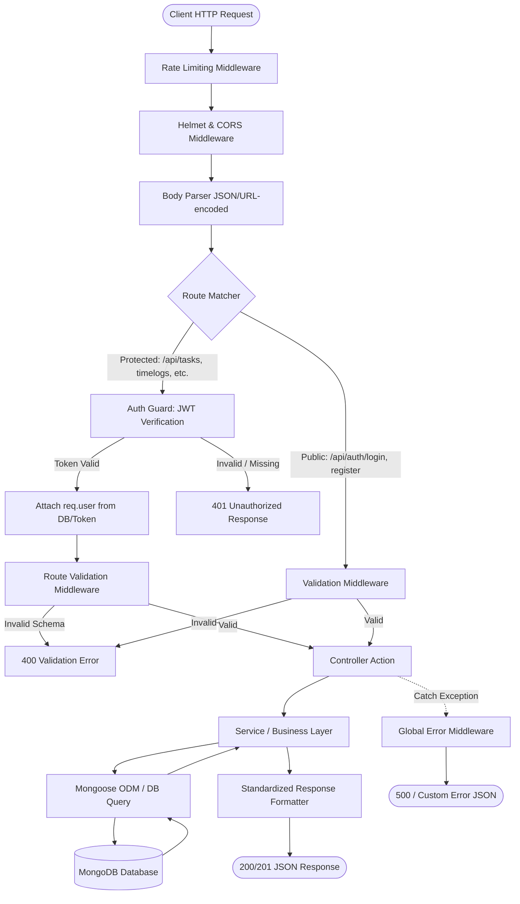
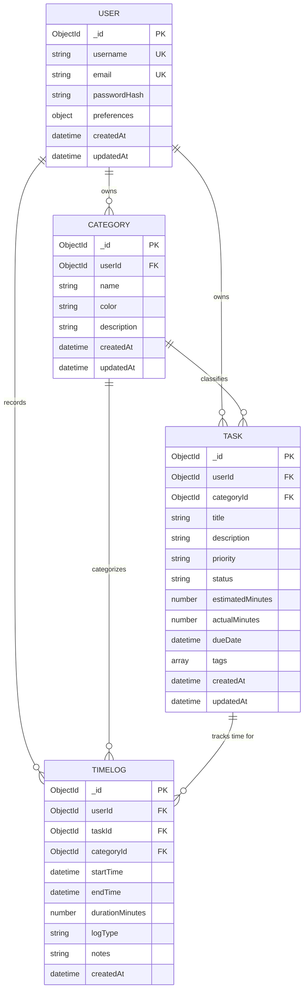

# System Architecture Document: ChronoCraft

**Project Name:** ChronoCraft (Personal Time Management Suite)  
**Document Version:** 1.0.0  
**Date:** August 2026  
**Reference Document:** [Product Requirement Document (PRD)](./prd.md)  
**Tech Stack:** MERN (MongoDB, Express.js, React.js with Vite, Node.js)

---

## 1. Executive Summary & Architectural Goals

ChronoCraft is architected as a lightweight, high-performance, single-user / personal productivity application built on the MERN stack. The system is designed to provide responsive interactions, millisecond-accurate time tracking resilient to browser throttling, modular data isolation, and low-latency analytics aggregation.

### 1.1 Core Architectural Principles
- **Separation of Concerns:** Clear multi-tier structure separating client presentation, API gateway/business routing, service logic, and database persistence.
- **Drift-Resilient Timer Engine:** Client-side time tracking relies on differential epoch timestamp calculation (`Date.now() - startTime`) rather than raw interval counts to prevent clock drift during background tab throttling.
- **State Continuity & Persistence:** Active tracking sessions survive page refreshes, route changes, and accidental browser closures via synchronized local persistence and server-side log checkpoints.
- **Aggregated Analytics Pipeline:** Database queries for productivity metrics leverage MongoDB Aggregation Framework pipelines to compute analytics server-side with minimal memory overhead.
- **Extensible & Self-Hostable:** Minimal external dependencies, container-ready architecture via Docker Compose, and environment-driven configurations.

---

## 2. High-Level System Architecture

```
+---------------------------------------------------------------------------------------+
|                                    CLIENT TIER                                        |
|                              React 18+ (Vite SPA)                                     |
|                                                                                       |
|  +--------------------+  +----------------------+  +-------------------------------+  |
|  |   UI Components    |  |  Global State Layer  |  |      Core Client Engines      |  |
|  | - Dashboard & Hub  |  | - Auth Context/Store |  | - Drift-Proof Timer Engine    |  |
|  | - Task/Kanban View |  | - Active Timer Store |  | - Audio Notification Manager  |  |
|  | - Calendar Grid    |  | - Theme & UI Store   |  | - API Client (Axios + JWT)    |  |
|  | - Analytics Charts |  | - Task Cache Store   |  | - LocalStorage Sync Adapter   |  |
|  +--------------------+  +----------------------+  +-------------------------------+  |
+-------------------------------------------+-------------------------------------------+
                                            |
                                            | HTTPS / REST API (JSON + Bearer JWT)
                                            v
+---------------------------------------------------------------------------------------+
|                                    SERVER TIER                                        |
|                              Node.js & Express.js                                     |
|                                                                                       |
|  +---------------------------------------------------------------------------------+  |
|  |                              Middleware Pipeline                                |  |
|  |   [Helmet Security] -> [CORS] -> [Rate Limiter] -> [Morgan] -> [JWT Auth Guard] |  |
|  +---------------------------------------------------------------------------------+  |
|                                            |                                          |
|  +-----------------------------------------v---------------------------------------+  |
|  |                            Controllers & Routers                                |  |
|  |   /api/auth       /api/categories       /api/tasks       /api/timelogs          |  |
|  |   /api/analytics  /api/settings                                                 |  |
|  +-----------------------------------------+---------------------------------------+  |
|                                            |                                          |
|  +-----------------------------------------v---------------------------------------+  |
|  |                        Service & Business Logic Layer                           |  |
|  | - Auth & Password Hashing Service        - Task & Duration Aggregator           |  |
|  | - Timer Validation & Overlap Sanitizer   - Analytics Metric Aggregator          |  |
|  +-----------------------------------------+---------------------------------------+  |
|                                            |                                          |
|  +-----------------------------------------v---------------------------------------+  |
|  |                         Data Access Layer (Mongoose)                            |  |
|  |   [User Model]     [Category Model]     [Task Model]     [TimeLog Model]        |  |
|  +---------------------------------------------------------------------------------+  |
+-------------------------------------------+-------------------------------------------+
                                            |
                                            | TCP / Mongoose Driver Connection
                                            v
+---------------------------------------------------------------------------------------+
|                                   DATABASE TIER                                       |
|                                      MongoDB                                          |
|                                                                                       |
|   +-------------------+  +---------------------+  +--------------------------------+  |
|   |   users Coll      |  |   categories Coll   |  |   tasks Coll                   |  |
|   |   (Auth & Prefs)  |  |   (Colors & Meta)   |  |   (Status, CategoryId, Priority|  |
|   +-------------------+  +---------------------+  +--------------------------------+  |
|   +--------------------------------------------+  +--------------------------------+  |
|   |   timelogs Coll                            |  |   Compound Indexes &           |  |
|   |   (userId, taskId, start, end, duration)   |  |   Aggregation Pipelines        |  |
|   +--------------------------------------------+  +--------------------------------+  |
+---------------------------------------------------------------------------------------+
```

---

## 3. Frontend Architecture (`/client`)

### 3.1 Technology Stack
- **Framework:** React 18+ (Single Page Application using Vite)
- **Styling:** Tailwind CSS + PostCSS (configured for `class` based Dark Mode)
- **Icons:** Lucide React
- **Routing:** React Router DOM (v6+) with Protected Route Wrappers
- **State Management:** Zustand or React Context API (Modular Stores for Auth, Timer, Tasks, and UI Settings)
- **Data Visualization:** Recharts (Donut chart for time distribution, bar charts for focus trends, estimation accuracy bars)
- **Drag and Drop:** `@hello-pangea/dnd` or `dnd-kit` (for Kanban board and Calendar time-blocking)
- **Date Handling:** `date-fns` (lightweight, modular date manipulation and formatting)
- **HTTP Client:** Axios with Request & Response Interceptors for JWT attachment and automatic `401 Unauthorized` token handling

### 3.2 Directory Structure
```
client/
├── public/
│   ├── favicon.ico
│   └── sounds/
│       ├── timer-finish.mp3
│       └── phase-switch.mp3
├── src/
│   ├── assets/
│   ├── components/
│   │   ├── common/              # Buttons, Modals, Badges, Tooltips, Inputs, Dropdowns
│   │   ├── layout/              # Sidebar, TopNav, ActiveTimerBar, AppShell
│   │   ├── feedback/            # ToastNotifications, LoadingSkeletons, EmptyStates
│   │   └── timers/              # MiniTimerDisplay, LargeTimerWheel, PhaseIndicator
│   ├── context/ / stores/       # Global State Stores
│   │   ├── authStore.js         # Auth state, JWT storage, user preferences
│   │   ├── timerStore.js        # Active timer status, mode, elapsed, active taskId
│   │   ├── taskStore.js         # Cached tasks, active filters, selected category
│   │   └── uiStore.js           # Theme (dark/light), sidebar state, modal controllers
│   ├── features/
│   │   ├── auth/                # Login, Register, ProtectedRoute
│   │   ├── dashboard/           # Summary cards, today's schedule, quick actions
│   │   ├── tasks/               # ListView, KanbanView, TaskModal, TaskCard, TaskFilters
│   │   ├── timer/               # StopwatchView, PomodoroView, ManualLogModal
│   │   ├── calendar/            # DailyTimelineGrid, WeeklyGrid, TimeBlockItem
│   │   └── analytics/           # CategoryDonutChart, TrendBarChart, AccuracyMeter
│   ├── hooks/
│   │   ├── useTimer.js          # Hook interfacing with timer engine & timestamp math
│   │   ├── useSoundNotification.js # Web Audio / HTML5 audio trigger hook
│   │   ├── useBrowserNotification.js # Web Notification API wrapper
│   │   └── useKeyboardShortcuts.js # Quick start/stop (Space), Task search (Cmd/Ctrl+K)
│   ├── services/
│   │   ├── api.js               # Axios instance setup with baseURL & auth headers
│   │   ├── authService.js       # Login, register, profile update API calls
│   │   ├── taskService.js       # Task CRUD API calls
│   │   ├── categoryService.js   # Category CRUD API calls
│   │   ├── timeLogService.js    # TimeLog creation and query API calls
│   │   └── analyticsService.js  # Analytics summary fetching
│   ├── utils/
│   │   ├── timeFormatters.js    # Seconds to HH:MM:SS, duration calculations
│   │   ├── dateUtils.js         # Date boundary calculation (startOfDay, endOfWeek)
│   │   └── colorUtils.js        # Category color luminance and badge styling
│   ├── App.jsx                  # Main router setup and global providers
│   ├── main.jsx                 # Vite root mount
│   └── index.css                # Tailwind directives and custom scrollbar styles
├── index.html
├── package.json
├── tailwind.config.js
└── vite.config.js
```

### 3.3 Timer Engine & Drift-Resilience Flow

To prevent time inaccuracy caused by background tab throttling in browsers:
1. When a timer starts, the client records `startTimestamp = Date.now()` and saves the timer snapshot (`{ isRunning: true, startTimestamp, taskId, mode, accumulatedSeconds }`) to `localStorage`.
2. A `setInterval` or `requestAnimationFrame` triggers UI updates at 100ms/1000ms intervals, computing:
   $$\text{Current Elapsed} = \text{accumulatedSeconds} + \left\lfloor \frac{\text{Date.now()} - \text{startTimestamp}}{1000} \right\rfloor$$
3. When navigating between routes or refreshing the tab, the state is rehydrated instantly with zero time lost.
4. On timer stop, the final duration is computed and a `POST /api/timelogs` request is dispatched to create an immutable log record and update the task's `actualMinutes`.



---

## 4. Backend Architecture (`/server`)

### 4.1 Technology Stack
- **Runtime:** Node.js (v18+ LTS)
- **Web Framework:** Express.js
- **Database Driver / ODM:** Mongoose (v8+)
- **Security & Middleware:**
  - `cors`: Cross-Origin Resource Sharing control
  - `helmet`: Secure HTTP response headers
  - `express-rate-limit`: Brute-force protection on auth routes
  - `bcryptjs`: Password hashing with salt factor $\ge 10$
  - `jsonwebtoken`: Cryptographic signing and validation of user tokens
  - `express-validator`: Request payload validation and sanitization
  - `morgan`: HTTP request logging

### 4.2 Directory Structure
```
server/
├── src/
│   ├── config/
│   │   ├── db.js                # MongoDB connection handler & event listeners
│   │   └── constants.js         # Enums (Priority, Status, LogTypes, Defaults)
│   ├── controllers/
│   │   ├── authController.js    # Register, login, profile, preferences
│   │   ├── categoryController.js# Category CRUD logic
│   │   ├── taskController.js    # Task CRUD, filters, reordering
│   │   ├── timeLogController.js # TimeLog entry, date range queries
│   │   └── analyticsController.js# Metrics aggregation pipelines
│   ├── middleware/
│   │   ├── authMiddleware.js    # JWT verification & req.user extraction
│   │   ├── validateMiddleware.js# express-validator schema runner
│   │   ├── errorMiddleware.js   # Global error handling and formatting
│   │   └── rateLimitMiddleware.js# IP rate limiting for auth endpoints
│   ├── models/
│   │   ├── User.js              # User model & embedded preferences
│   │   ├── Category.js          # Category/Project taxonomy model
│   │   ├── Task.js              # Task model with status, priority, estimates
│   │   └── TimeLog.js           # Time tracking log records
│   ├── routes/
│   │   ├── authRoutes.js        # /api/auth
│   │   ├── categoryRoutes.js    # /api/categories
│   │   ├── taskRoutes.js        # /api/tasks
│   │   ├── timeLogRoutes.js     # /api/timelogs
│   │   └── analyticsRoutes.js   # /api/analytics
│   ├── services/
│   │   ├── analyticsService.js  # MongoDB aggregate pipeline definitions
│   │   └── timeLogService.js    # Time recalculation & task duration sync
│   ├── utils/
│   │   ├── apiResponse.js       # Standardized response helper
│   │   └── tokenHelper.js       # JWT creation and expiry settings
│   ├── app.js                   # Express app setup and middleware configuration
│   └── server.js                # Server entry point & port listener
├── .env.example
├── package.json
└── Dockerfile
```

### 4.3 Request-Response Lifecycle & Pipeline



### 4.4 Standardized API Response Protocol
All endpoints return consistent JSON payloads:

**Success Response:**
```json
{
  "success": true,
  "data": { ... },
  "message": "Optional descriptive status message"
}
```

**Error Response:**
```json
{
  "success": false,
  "error": {
    "code": "VALIDATION_ERROR | UNAUTHORIZED | NOT_FOUND | INTERNAL_ERROR",
    "message": "Human-readable explanation of error",
    "details": [ ... ]
  }
}
```

---

## 5. Database Architecture & Data Models

### 5.1 Entity Relationship Diagram (ERD)



### 5.2 Schema Specifications & Indexing Strategy

#### 1. `User` Schema
- **Embedded Preferences:**
  - `dailyGoalHours` (Number, default `8`, range `1-24`)
  - `pomodoroWorkMinutes` (Number, default `25`)
  - `pomodoroShortBreakMinutes` (Number, default `5`)
  - `pomodoroLongBreakMinutes` (Number, default `15`)
  - `pomodoroLongBreakInterval` (Number, default `4`)
  - `theme` (String, enum: `['dark', 'light']`, default `'dark'`)
- **Indexes:**
  - `{ email: 1 }` (Unique)
  - `{ username: 1 }` (Unique)

#### 2. `Category` Schema
- **Fields:** `userId` (FK), `name`, `color` (Hex format, e.g. `#3B82F6`), `description`.
- **Indexes:**
  - `{ userId: 1, name: 1 }` (Compound unique index to prevent duplicate category names per user).

#### 3. `Task` Schema
- **Fields:** `userId` (FK), `categoryId` (FK, nullable), `title`, `description`, `priority` (`Low`, `Medium`, `High`, `Urgent`), `status` (`To Do`, `In Progress`, `Completed`, `Archived`), `estimatedMinutes`, `actualMinutes`, `dueDate`, `tags` (Array of Strings).
- **Indexes:**
  - `{ userId: 1, status: 1 }` (Optimizes task board & list queries)
  - `{ userId: 1, categoryId: 1 }` (Optimizes category filtering)
  - `{ userId: 1, dueDate: 1 }` (Optimizes upcoming schedule queries)

#### 4. `TimeLog` Schema
- **Fields:** `userId` (FK), `taskId` (FK, nullable), `categoryId` (FK, nullable), `startTime` (Date), `endTime` (Date), `durationMinutes` (Number), `logType` (`stopwatch`, `pomodoro`, `manual`), `notes` (String).
- **Indexes:**
  - `{ userId: 1, startTime: -1 }` (Optimizes timeline & recent logs retrieval)
  - `{ userId: 1, startTime: 1, endTime: 1 }` (Optimizes calendar grid range filtering)
  - `{ taskId: 1 }` (Optimizes task-specific history queries)

### 5.3 Data Integrity & Cascading Policies
- **Category Deletion:** When a category is deleted, dependent tasks and time logs are updated with `categoryId: null` (Uncategorized) rather than hard-deleting the user's tasks or tracking history.
- **Task Deletion:** When a task is deleted, associated `TimeLog` records maintain `taskId: null` while preserving category, duration, and timestamp details to ensure historical productivity analytics remain accurate.
- **Duration Auto-Sync:** Upon saving/deleting a `TimeLog` linked to a `taskId`, an atomic Mongoose post-save hook or service recalculates the total `actualMinutes` for the corresponding task:
  $$\text{Task.actualMinutes} = \sum \text{TimeLog.durationMinutes (for taskId)}$$

---

## 6. Detailed API Endpoint Specifications

### 6.1 Authentication & Profile (`/api/auth`)
| Method | Endpoint | Description | Auth Required |
| :--- | :--- | :--- | :--- |
| `POST` | `/api/auth/register` | Register new user with username, email, password | No |
| `POST` | `/api/auth/login` | Authenticate credentials and return JWT | No |
| `GET` | `/api/auth/me` | Fetch authenticated user profile and preferences | Yes |
| `PUT` | `/api/auth/preferences`| Update user preferences (Pomodoro lengths, daily goal, theme) | Yes |

### 6.2 Category Management (`/api/categories`)
| Method | Endpoint | Description | Auth Required |
| :--- | :--- | :--- | :--- |
| `GET` | `/api/categories` | List all categories for the authenticated user | Yes |
| `POST` | `/api/categories` | Create a new category with name, color, and description | Yes |
| `PUT` | `/api/categories/:id` | Update category name, color, or description | Yes |
| `DELETE` | `/api/categories/:id` | Delete category and detach from existing tasks/logs | Yes |

### 6.3 Task Management (`/api/tasks`)
| Method | Endpoint | Description | Auth Required |
| :--- | :--- | :--- | :--- |
| `GET` | `/api/tasks` | Fetch tasks with query params (`status`, `categoryId`, `priority`, `search`) | Yes |
| `POST` | `/api/tasks` | Create a new task | Yes |
| `GET` | `/api/tasks/:id` | Get task details including linked time log summary | Yes |
| `PUT` | `/api/tasks/:id` | Update task title, status, priority, category, or estimates | Yes |
| `DELETE` | `/api/tasks/:id` | Delete task | Yes |

### 6.4 Time Tracking & Logs (`/api/timelogs`)
| Method | Endpoint | Description | Auth Required |
| :--- | :--- | :--- | :--- |
| `GET` | `/api/timelogs` | Fetch logs filtered by date range (`startDate`, `endDate`, `taskId`) | Yes |
| `POST` | `/api/timelogs` | Create a new time log (from stopwatch, Pomodoro, or manual) | Yes |
| `PUT` | `/api/timelogs/:id` | Edit an existing time log's start/end times or notes | Yes |
| `DELETE` | `/api/timelogs/:id` | Delete a time log entry and update task `actualMinutes` | Yes |

### 6.5 Analytics & Reporting (`/api/analytics`)
| Method | Endpoint | Description | Auth Required |
| :--- | :--- | :--- | :--- |
| `GET` | `/api/analytics/summary` | Query aggregate metrics for a timeframe (`period=day\|week\|month`) | Yes |
| `GET` | `/api/analytics/distribution` | Category-wise duration breakdown for donut charts | Yes |
| `GET` | `/api/analytics/trends` | Daily focus time vs. daily goal target array | Yes |
| `GET` | `/api/analytics/estimation-accuracy` | Comparison of estimated vs actual time across tasks | Yes |

---

## 7. Analytics Aggregation Pipeline Design

To deliver instant analytics without client-side heavy computations, the backend executes targeted MongoDB Aggregation Pipelines:

### 7.1 Category Time Distribution Pipeline
```javascript
[
  {
    $match: {
      userId: new mongoose.Types.ObjectId(userId),
      startTime: { $gte: startDate, $lte: endDate }
    }
  },
  {
    $group: {
      _id: "$categoryId",
      totalMinutes: { $sum: "$durationMinutes" },
      sessionCount: { $sum: 1 }
    }
  },
  {
    $lookup: {
      from: "categories",
      localField: "_id",
      foreignField: "_id",
      as: "category"
    }
  },
  {
    $unwind: { path: "$category", preserveNullAndEmptyArrays: true }
  },
  {
    $project: {
      categoryId: "$_id",
      categoryName: { $ifNull: ["$category.name", "Uncategorized"] },
      color: { $ifNull: ["$category.color", "#94A3B8"] },
      totalMinutes: 1,
      totalHours: { $round: [{ $divide: ["$totalMinutes", 60] }, 2] },
      sessionCount: 1
    }
  },
  { $sort: { totalMinutes: -1 } }
]
```

### 7.2 Daily Focus Trend Pipeline
Groups logs by formatted calendar date (`YYYY-MM-DD`), sums tracked minutes, and compares against the user's `dailyGoalHours * 60` to calculate goal achievement and streaks.

---

## 8. Security & Performance Architecture

### 8.1 Security Safeguards
1. **Password Protection:** Hashes passwords with `bcryptjs` with salt factor 10. Passwords are never returned in queries (`select: false`).
2. **JWT Authentication:** Stateless tokens signed with `JWT_SECRET` with configurable expiry (e.g., 7 days). Validated via middleware on all private routes.
3. **Data Isolation (Tenant Safety):** Every query enforces `userId: req.user._id` to prevent unauthorized cross-user access or manipulation.
4. **Input Validation & Sanitization:** Payload keys are strictly validated using `express-validator` to reject malformed data and mitigate NoSQL injection.
5. **Security Headers & CORS:** Helmet injects modern HTTP headers (`Content-Security-Policy`, `X-Frame-Options`, `X-Content-Type-Options`), while CORS restricts unauthorized origin invocations.

### 8.2 Performance Optimizations
1. **Vite SPA Bundling:** Tree-shaking and dynamic code-splitting via `React.lazy()` for Analytics and Calendar routes to minimize initial bundle size.
2. **Database Indexing:** All foreign keys and query filters (`userId`, `status`, `startTime`) are covered by composite indexes.
3. **Compound Aggregation:** Heavy numerical computations (totals, streaks, averages) are offloaded to MongoDB native aggregation operations.
4. **Client State Caching:** In-memory caching for categories and task lists to prevent redundant network round-trips during navigation.

---

## 9. Deployment & Infrastructure Architecture

### 9.1 Self-Hosted Docker Architecture
ChronoCraft provides a containerized setup via `docker-compose.yml` for single-command deployment on personal servers (VPS, Raspberry Pi, or local machines).

```
+-------------------------------------------------------------------+
|                        Docker Host / VPS                          |
|                                                                   |
|  +---------------------+        +------------------------------+  |
|  |   Reverse Proxy     |        |      Docker Network          |  |
|  |   (Nginx / Caddy)   |        |                              |  |
|  |   Ports 80 / 443    |        |  +------------------------+  |  |
|  +----------+----------+        |  |  chronocraft-client    |  |  |
|             |                   |  |  (Nginx SPA Alpine)    |  |  |
|             |                   |  +------------+-----------+  |  |
|             +-- / ------------->|               |              |  |
|             |                   |  +------------v-----------+  |  |
|             +-- /api ---------->|  |  chronocraft-server    |  |  |
|                                 |  |  (Node.js Alpine)      |  |  |
|                                 |  +------------+-----------+  |  |
|                                 |               |              |  |
|                                 |  +------------v-----------+  |  |
|                                 |  |  chronocraft-db        |  |  |
|                                 |  |  (MongoDB 7.0 + Volume)|  |  |
|                                 |  +------------------------+  |  |
|                                 +------------------------------+  |
+-------------------------------------------------------------------+
```

### 9.2 Docker Compose Configuration Blueprint
- **Service 1 (`db`):** `mongo:7.0-jammy` with persistent named volume `mongo-data`.
- **Service 2 (`server`):** Node.js 18-alpine container running Express API, linked to `db`.
- **Service 3 (`client`):** Multi-stage built React Vite SPA served via Nginx with API reverse proxy rules.

### 9.3 Environment Configuration Variables

#### Backend (`server/.env`)
```env
PORT=5000
NODE_ENV=production
MONGO_URI=mongodb://db:27017/chronocraft
JWT_SECRET=your_super_secret_jwt_key_change_in_production
JWT_EXPIRES_IN=7d
CLIENT_URL=http://localhost:3000
```

#### Frontend (`client/.env`)
```env
VITE_API_BASE_URL=/api
```

---

## 10. Summary & Traceability Matrix

| PRD Section | Architectural Module | Implementation Reference |
| :--- | :--- | :--- |
| **4.1 Auth & Preferences** | Auth Controller & Middleware, `User` Model | `server/src/controllers/authController.js`, `client/src/context/authStore.js` |
| **4.2 Task Management** | Task & Category Controllers & Models | `server/src/controllers/taskController.js`, `client/src/features/tasks/` |
| **4.3 Time Tracking & Timers**| TimeLog Model & Frontend Timer Engine | `client/src/hooks/useTimer.js`, `server/src/controllers/timeLogController.js` |
| **4.4 Time-Blocking Calendar**| Calendar Feature & Date Range Queries | `client/src/features/calendar/`, `server/src/routes/timeLogRoutes.js` |
| **4.5 Analytics Dashboard** | MongoDB Aggregation Pipelines | `server/src/services/analyticsService.js`, `client/src/features/analytics/` |
| **8. Non-Functional Req.** | Security Middleware & Indexed Schemas | `server/src/middleware/`, `server/src/config/db.js` |
