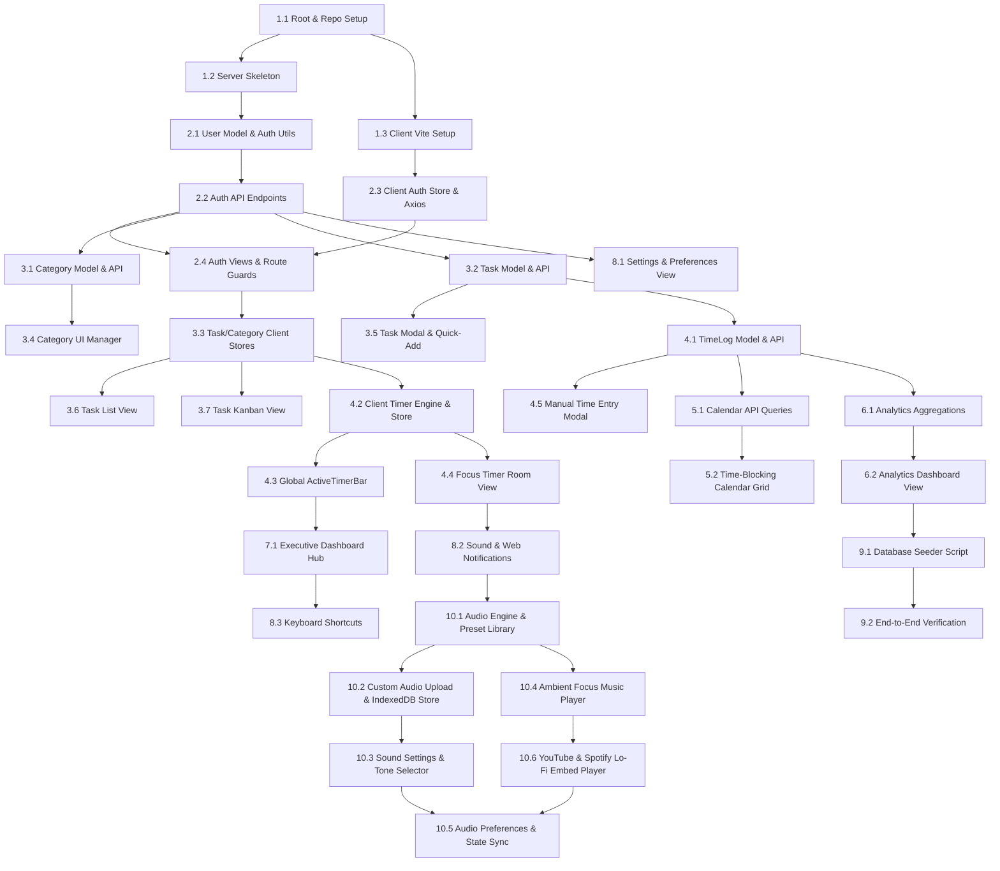

# ChronoCraft: Detailed Task Breakdown (`tasks.md`)

**Reference Documents:**
- [PRD (Product Requirement Document)](./prd.md)
- [System Architecture Document](./architecture.md)
- [Application Flow & User Journey Document](./app-flow.md)

**Tech Stack:** MongoDB, Express.js, React.js (Vite), Node.js, Tailwind CSS  
**Target Execution:** Agentic / Step-by-Step Autonomous Implementation

---

## Task Dependency Graph

---

## Phase 1: Project Setup & Baseline Infrastructure

- [x] **Task 1.1: Root Repository & Monorepo Structure Setup**
  - **Objective:** Configure root repository files, package scripts, and development orchestration.
  - **Target Files:** `package.json` (root), `.gitignore`, `.env.example`, `README.md`
  - **Detailed Steps:**
    1. Initialize root `package.json` with scripts: `dev` (runs client & server concurrently), `dev:server`, `dev:client`, `install:all`, and `build`.
    2. Add development dependencies: `concurrently`, `nodemon`.
    3. Define `.env.example` with `PORT=5000`, `NODE_ENV=development`, `MONGODB_URI=mongodb://localhost:27017/chronocraft`, `JWT_SECRET=your_jwt_secret_key_change_in_production`, `JWT_EXPIRES_IN=7d`, `CLIENT_URL=http://localhost:5173`.
    4. Ensure `.gitignore` ignores `node_modules/`, `dist/`, `.env`, and OS/IDE files.
  - **Acceptance Criteria:** Running `npm run dev` concurrently launches both server and client without errors.

- [x] **Task 1.2: Server Initialization & Middleware Pipeline**
  - **Objective:** Create Node.js Express server with database connection, security headers, CORS, and centralized error handling.
  - **Target Files:** `server/package.json`, `server/src/server.js`, `server/src/config/db.js`, `server/src/middleware/errorHandler.js`
  - **Detailed Steps:**
    1. Initialize `server/package.json` with dependencies: `express`, `mongoose`, `dotenv`, `cors`, `helmet`, `morgan`, `jsonwebtoken`, `bcryptjs`.
    2. Create `server/src/config/db.js` with robust Mongoose connection logic and event listeners (`connected`, `error`, `disconnected`).
    3. In `server/src/server.js`, configure Express with `helmet()`, `cors({ origin: process.env.CLIENT_URL, credentials: true })`, `express.json()`, `express.urlencoded()`, and `morgan('dev')`.
    4. Add a healthcheck route: `GET /api/health` returning `{ status: 'ok', timestamp: Date.now() }`.
    5. Implement custom error middleware in `server/src/middleware/errorHandler.js` handling `CastError`, `ValidationError`, duplicate key errors (`code: 11000`), and standard 500 errors.
  - **Acceptance Criteria:** Server starts cleanly on port 5000; `GET /api/health` returns `200 OK`; MongoDB connects successfully.

- [x] **Task 1.3: Client Initialization (React + Vite + Tailwind CSS)**
  - **Objective:** Scaffold the frontend SPA using Vite, React 18, Tailwind CSS, Lucide icons, and React Router.
  - **Target Files:** `client/package.json`, `client/vite.config.js`, `client/tailwind.config.js`, `client/src/index.css`, `client/src/main.jsx`, `client/src/App.jsx`, `client/src/services/api.js`
  - **Detailed Steps:**
    1. Initialize `client` using Vite React template.
    2. Install dependencies: `react-router-dom`, `lucide-react`, `zustand`, `clsx`, `tailwind-merge`, `date-fns`, `recharts`, `axios`, `@hello-pangea/dnd`.
    3. Configure `tailwind.config.js` with `darkMode: 'class'` and custom color schemes (slate/zinc dark palette with primary accent `#3B82F6`).
    4. Configure `client/src/services/api.js` creating an Axios instance with `baseURL: import.meta.env.VITE_API_URL || 'http://localhost:5000/api'`.
    5. Setup basic App router in `client/src/App.jsx` with placeholder routes.
  - **Acceptance Criteria:** `npm run dev:client` boots Vite dev server at `http://localhost:5173`; Tailwind classes render properly.

---

## Phase 2: Authentication & User Profile Management

- [x] **Task 2.1: User Model & Auth Utility Functions**
  - **Objective:** Define MongoDB User schema with embedded preferences and password encryption helpers.
  - **Target Files:** `server/src/models/User.js`, `server/src/utils/tokenUtils.js`
  - **Detailed Steps:**
    1. Create `server/src/models/User.js` schema with `username`, `email`, `passwordHash`, and `preferences` (`dailyGoalHours: 8`, `pomodoroWorkMinutes: 25`, `pomodoroShortBreakMinutes: 5`, `pomodoroLongBreakMinutes: 15`, `longBreakInterval: 4`, `theme: 'dark'`, `soundEnabled: true`).
    2. Add Mongoose pre-save hook for bcrypt password hashing (salt rounds: 10) when password is modified.
    3. Add instance method `comparePassword(candidatePassword)` on User schema.
    4. Implement `tokenUtils.js` with `generateToken(userId)` and `verifyToken(token)` using `jsonwebtoken`.
  - **Acceptance Criteria:** Passwords are automatically hashed prior to DB persistence; `comparePassword` correctly validates credentials.

- [x] **Task 2.2: Backend Auth Endpoints & Protection Middleware**
  - **Objective:** Implement REST controllers for user registration, login, profile retrieval, and preference updates.
  - **Target Files:** `server/src/controllers/authController.js`, `server/src/routes/authRoutes.js`, `server/src/middleware/authMiddleware.js`
  - **Detailed Steps:**
    1. Create `authMiddleware.js` verifying Bearer JWT, querying user without `passwordHash`, and attaching `req.user`.
    2. In `authController.js`, implement `register`, `login`, `getMe`, and `updatePreferences`.
    3. Mount routes in `authRoutes.js` at `/api/auth`.
  - **Acceptance Criteria:** `POST /api/auth/register` and `POST /api/auth/login` issue JWT; `GET /api/auth/me` and `PUT /api/auth/preferences` require valid Bearer token.

- [x] **Task 2.3: Frontend Auth Store & Axios Interceptors**
  - **Objective:** Manage authentication state, token storage, and automatic API token attachment.
  - **Target Files:** `client/src/stores/authStore.js`, `client/src/services/authService.js`, `client/src/services/api.js`
  - **Detailed Steps:**
    1. Implement `authService.js` wrappers for auth endpoints.
    2. Create `authStore.js` (Zustand) with `user`, `token`, `isAuthenticated`, `isLoading`, `theme`, and actions `login`, `register`, `logout`, `checkAuth`, `updatePreferences`.
    3. Update `client/src/services/api.js` with Axios request/response interceptors for Bearer token attachment and automatic 401 logout handling.
  - **Acceptance Criteria:** Token persists across page reloads in `localStorage`; state reflects auth status accurately.

- [x] **Task 2.4: Auth UI Views & Protected Route Wrappers**
  - **Objective:** Build responsive Login and Register pages and navigation guards.
  - **Target Files:** `client/src/features/auth/LoginView.jsx`, `client/src/features/auth/RegisterView.jsx`, `client/src/features/auth/ProtectedRoute.jsx`, `client/src/components/layout/AppShell.jsx`
  - **Detailed Steps:**
    1. Create dark-themed `LoginView.jsx` and `RegisterView.jsx` with input validation and error alerts.
    2. Build `ProtectedRoute.jsx` redirecting unauthenticated users to `/login` and rendering `<Outlet />` inside `AppShell`.
    3. Implement `AppShell.jsx` featuring responsive Sidebar navigation, Top Navigation bar, and Main content view.
  - **Acceptance Criteria:** Protected routes guard unauthorized access; successful auth redirects to `/dashboard`.

---

## Phase 3: Categories & Task Management

- [x] **Task 3.1: Category Model, Controller & API Routes**
  - **Objective:** Create backend infrastructure for user-isolated task categories with customizable color hex codes.
  - **Target Files:** `server/src/models/Category.js`, `server/src/controllers/categoryController.js`, `server/src/routes/categoryRoutes.js`
  - **Detailed Steps:**
    1. Create `Category.js` schema with `userId`, `name`, `color` (default: `#3B82F6`), `description`, and compound unique index `{ userId: 1, name: 1 }`.
    2. Implement `categoryController.js` handling `getCategories`, `createCategory`, `updateCategory`, and `deleteCategory` (with task cascade unlinking).
    3. Mount routes in `categoryRoutes.js` at `/api/categories`.
  - **Acceptance Criteria:** Full CRUD works with JWT; categories are isolated per user.

- [x] **Task 3.2: Task Model, Controller & API Routes**
  - **Objective:** Create task schema and endpoints with filtering, sorting, status updates, and duration totals.
  - **Target Files:** `server/src/models/Task.js`, `server/src/controllers/taskController.js`, `server/src/routes/taskRoutes.js`
  - **Detailed Steps:**
    1. Create `Task.js` schema with `userId`, `categoryId`, `title`, `description`, `priority` (`Low`, `Medium`, `High`, `Urgent`), `status` (`To Do`, `In Progress`, `Completed`, `Archived`), `estimatedMinutes`, `actualMinutes`, `dueDate`, `tags`, and indexes on `{ userId: 1, status: 1 }`, `{ userId: 1, dueDate: 1 }`.
    2. Implement `taskController.js` with `getTasks` (filtering by status, category, priority, search), `getTaskById`, `createTask`, `updateTask`, and `deleteTask`.
    3. Register routes at `/api/tasks`.
  - **Acceptance Criteria:** Filtered queries return accurate task lists; status and metadata update properly.

- [x] **Task 3.3: Frontend Task & Category State Stores & Services**
  - **Objective:** Implement client-side API clients and Zustand stores for categories and tasks.
  - **Target Files:** `client/src/services/categoryService.js`, `client/src/services/taskService.js`, `client/src/stores/taskStore.js`
  - **Detailed Steps:**
    1. Create `categoryService.js` and `taskService.js` calling the respective REST endpoints.
    2. Create `taskStore.js` (Zustand) with state: `tasks`, `categories`, `activeFilter`, `activeView` (`list` | `kanban`), `selectedTask`, `isLoading`.
    3. Implement actions for fetching, adding, updating, deleting tasks/categories, and optimistic status updates.
  - **Acceptance Criteria:** Store maintains cached tasks/categories with responsive optimistic updates.

- [x] **Task 3.4: Category Management UI (Modal & Color Picker)**
  - **Objective:** Build category creation and editing modal with preset hex color palette and management list.
  - **Target Files:** `client/src/features/tasks/components/CategoryModal.jsx`, `client/src/components/common/ColorPicker.jsx`, `client/src/components/common/Badge.jsx`
  - **Detailed Steps:**
    1. Create `ColorPicker.jsx` with preset palette chips and custom hex color input.
    2. Build `CategoryModal.jsx` displaying user categories with edit/delete buttons and inline creation form.
    3. Build `Badge.jsx` component rendering colored category pills with high-contrast text.
  - **Acceptance Criteria:** User can add, edit, or delete categories and pick custom colors.

- [x] **Task 3.5: Task Modal & Quick-Add Component**
  - **Objective:** Build modal for creating and editing tasks with all metadata attributes.
  - **Target Files:** `client/src/features/tasks/components/TaskModal.jsx`, `client/src/features/tasks/components/QuickAddInput.jsx`, `client/src/components/common/Modal.jsx`
  - **Detailed Steps:**
    1. Create reusable `Modal.jsx` with backdrop blur and `Esc` key listener.
    2. Build `TaskModal.jsx` with title, category dropdown, priority selector, status dropdown, estimated duration (minutes), due date picker, description, and tags input.
    3. Build `QuickAddInput.jsx` for 1-click inline task creation from the dashboard or header.
  - **Acceptance Criteria:** Creating or editing a task persists to backend and immediately updates store.

- [x] **Task 3.6: Task Hub - List View with Filtering & Sorting**
  - **Objective:** Create clean list view for tasks with search, category filtering, and status toggling.
  - **Target Files:** `client/src/features/tasks/TasksView.jsx`, `client/src/features/tasks/components/TaskListView.jsx`, `client/src/features/tasks/components/TaskListItem.jsx`, `client/src/features/tasks/components/TaskFilters.jsx`
  - **Detailed Steps:**
    1. In `TaskFilters.jsx`, add search input, status pills (All, To Do, In Progress, Completed), category filter, and priority filter.
    2. Build `TaskListItem.jsx` with completion checkbox, category badge, priority badge, overdue indicators, estimated vs actual time tags, and quick-start timer button.
    3. Support sorting by due date, priority, and creation date.
  - **Acceptance Criteria:** Tasks filter and sort smoothly; clicking start timer assigns task to active timer.

- [x] **Task 3.7: Task Hub - Kanban Board with Drag-and-Drop**
  - **Objective:** Build interactive Kanban board with drag-and-drop column status transitions.
  - **Target Files:** `client/src/features/tasks/components/KanbanView.jsx`, `client/src/features/tasks/components/KanbanColumn.jsx`, `client/src/features/tasks/components/KanbanCard.jsx`
  - **Detailed Steps:**
    1. Integrate `@hello-pangea/dnd` in `KanbanView.jsx` with `To Do`, `In Progress`, and `Completed` columns.
    2. In `KanbanCard.jsx`, render task title, category pill, priority tag, due date, estimated minutes, and play button.
    3. Implement `onDragEnd` to optimistically update task status and sync with `/api/tasks/:id`.
  - **Acceptance Criteria:** Dragging a card between columns updates its status in the UI and backend database.

---

## Phase 4: Time Tracking Engine (Stopwatch, Pomodoro & TimeLogs)

- [x] **Task 4.1: TimeLog Model, Controller & Aggregation API**
  - **Objective:** Build backend schema and endpoints for immutable time tracking logs and task duration auto-calculation.
  - **Target Files:** `server/src/models/TimeLog.js`, `server/src/controllers/timeLogController.js`, `server/src/routes/timeLogRoutes.js`
  - **Detailed Steps:**
    1. Create `TimeLog.js` schema with `userId`, `taskId`, `categoryId`, `startTime`, `endTime`, `durationMinutes`, `logType` (`stopwatch`, `pomodoro`, `manual`), `notes`, and index on `{ userId: 1, startTime: 1, endTime: 1 }`.
    2. Implement `timeLogController.js`: `getTimeLogs` (query by date range), `createTimeLog` (calculates `durationMinutes` and increments `actualMinutes` on the linked task), `deleteTimeLog` (recalculates task `actualMinutes`).
    3. Mount routes at `/api/timelogs`.
  - **Acceptance Criteria:** Time logs save accurately and automatically update the corresponding task's `actualMinutes`.

- [x] **Task 4.2: Frontend Drift-Resilient Timer Engine & timerStore**
  - **Objective:** Create high-precision client timer state based on epoch timestamps that survives background tab throttling and page reloads.
  - **Target Files:** `client/src/stores/timerStore.js`, `client/src/hooks/useTimer.js`, `client/src/utils/timeFormatters.js`
  - **Detailed Steps:**
    1. Write `timeFormatters.js` for formatting seconds to `HH:MM:SS` and minutes to readable hours.
    2. Create `timerStore.js` (Zustand with localStorage persistence) storing `mode` (`stopwatch` | `pomodoro`), `status` (`idle` | `running` | `paused`), `activeTaskId`, `sessionStartTime`, `accumulatedSeconds`, `pomodoroPhase`, and `pomodoroCyclesCompleted`.
    3. In `useTimer.js`, calculate elapsed seconds via `accumulatedSeconds + Math.floor((Date.now() - sessionStartTime) / 1000)` to ensure zero clock drift during browser throttling.
  - **Acceptance Criteria:** Timer maintains exact wall-clock time after background tab throttling or page refresh.

- [x] **Task 4.3: Global TopNav & AppShell ActiveTimerBar**
  - **Objective:** Build persistent header bar displaying real-time timer status, active task label, and one-click controls.
  - **Target Files:** `client/src/components/layout/ActiveTimerBar.jsx`, `client/src/components/layout/TopNav.jsx`
  - **Detailed Steps:**
    1. Create `ActiveTimerBar.jsx` in `AppShell`: shows active task title, category color dot, ticking digital clock, play/pause button, and Stop & Save button.
    2. When idle, offer a quick-start task selector dropdown.
  - **Acceptance Criteria:** Active timer remains visible and controllable across all pages.

- [x] **Task 4.4: Dedicated Focus Room View (`/timer`)**
  - **Objective:** Build full-page immersive focus room with large circular timer wheel, Pomodoro phase transitions, and active task card.
  - **Target Files:** `client/src/features/timer/FocusTimerView.jsx`, `client/src/features/timer/components/TimerWheel.jsx`, `client/src/features/timer/components/PomodoroControls.jsx`, `client/src/features/timer/components/ActiveTaskCard.jsx`
  - **Detailed Steps:**
    1. Build SVG `TimerWheel.jsx` showing animated countdown or progress ring.
    2. In `PomodoroControls.jsx`, support switching between Work (25m), Short Break (5m), and Long Break (15m).
    3. In `ActiveTaskCard.jsx`, display current task details, estimated vs actual progress bar, and switch task option.
    4. On phase expiration, trigger sound chime and automatically save completed work log to `/api/timelogs`.
  - **Acceptance Criteria:** Full Pomodoro cycle operates smoothly with visual progress ring and log creation.

- [x] **Task 4.5: Manual Time Entry Modal**
  - **Objective:** Allow users to log past time blocks manually with start/end time pickers and notes.
  - **Target Files:** `client/src/features/timer/components/ManualLogModal.jsx`
  - **Detailed Steps:**
    1. Build `ManualLogModal.jsx` with date picker, start/end time pickers, auto-calculated duration readout, task selector, category selector, and notes.
    2. Dispatch `POST /api/timelogs` and refresh task/analytics store on submission.
  - **Acceptance Criteria:** Manual entries validate that end time > start time and successfully log time.

---

## Phase 5: Time-Blocking & Calendar View

- [x] **Task 5.1: Calendar API Query Endpoints & Formatting**
  - **Objective:** Backend query handling for fetching scheduled tasks and logged time blocks for specific date ranges.
  - **Target Files:** `server/src/controllers/timeLogController.js`, `server/src/controllers/taskController.js`
  - **Detailed Steps:**
    1. Verify `/api/timelogs?startDate=YYYY-MM-DD&endDate=YYYY-MM-DD` populates `taskId` and `categoryId`.
    2. Verify `/api/tasks?dueDateStart=YYYY-MM-DD&dueDateEnd=YYYY-MM-DD` returns scheduled tasks in the query window.
  - **Acceptance Criteria:** Backend delivers combined logs and scheduled tasks for daily and weekly calendar views.

- [x] **Task 5.2: Interactive Daily & Weekly Time-Blocking Grid View**
  - **Objective:** Build visual hourly schedule grid comparing planned tasks with actual completed time logs.
  - **Target Files:** `client/src/features/calendar/CalendarView.jsx`, `client/src/features/calendar/components/DailyTimelineGrid.jsx`, `client/src/features/calendar/components/WeeklyTimelineGrid.jsx`, `client/src/features/calendar/components/TimeBlockItem.jsx`
  - **Detailed Steps:**
    1. In `DailyTimelineGrid.jsx`, render 24-hour vertical timeline grid (00:00 - 23:00) with 30-minute subdivisions and a red current-time marker.
    2. Position completed time logs as solid colored blocks based on start time and duration minutes.
    3. Render planned/due tasks as distinct outlined cards alongside actual logged blocks.
    4. Build `WeeklyTimelineGrid.jsx` with 7 day columns (Monday to Sunday).
    5. Allow clicking an empty grid slot to trigger `ManualLogModal` pre-populated with clicked time.
  - **Acceptance Criteria:** Time logs display in correct hourly slots with category colors; empty slots allow quick logging.

---

## Phase 6: Productivity Analytics & Reporting

- [x] **Task 6.1: Backend Analytics MongoDB Aggregation Pipelines**
  - **Objective:** Develop high-performance aggregation endpoint computing time distribution, daily trends, estimation accuracy, and streaks.
  - **Target Files:** `server/src/controllers/analyticsController.js`, `server/src/routes/analyticsRoutes.js`
  - **Detailed Steps:**
    1. Implement `GET /api/analytics/summary?period=today|week|month`:
       - **Category Breakdown:** Aggregate `TimeLog` grouped by `categoryId`, summing duration, joining category name/color.
       - **Daily Focus Trend:** Aggregate logs grouped by date string, summing total hours per day for last 7/30 days.
       - **Estimation Accuracy:** Calculate accuracy percentage on tasks where `actualMinutes > 0`.
       - **Streak Calculation:** Query consecutive past dates where total tracked time >= user's `dailyGoalHours`.
       - **Total Time Tracked:** Sum of minutes in requested period.
    2. Mount route `GET /api/analytics/summary` in `analyticsRoutes.js`.
  - **Acceptance Criteria:** Aggregation query responds with complete metrics in <100ms.

- [x] **Task 6.2: Frontend Analytics Dashboard View**
  - **Objective:** Render interactive charts and metric cards using Recharts.
  - **Target Files:** `client/src/features/analytics/AnalyticsView.jsx`, `client/src/features/analytics/components/CategoryDonutChart.jsx`, `client/src/features/analytics/components/FocusTrendBarChart.jsx`, `client/src/features/analytics/components/EstimationAccuracyCard.jsx`, `client/src/features/analytics/components/StreakTrackerCard.jsx`, `client/src/services/analyticsService.js`
  - **Detailed Steps:**
    1. Build period filter selector (`Today`, `This Week`, `This Month`).
    2. Implement `CategoryDonutChart.jsx` with Recharts `PieChart`, `Pie`, `Cell`, `Tooltip` showing time distribution.
    3. Implement `FocusTrendBarChart.jsx` with Recharts `BarChart` comparing daily tracked hours against target line.
    4. Build `EstimationAccuracyCard.jsx` showing average estimation precision ratio.
    5. Build `StreakTrackerCard.jsx` showing current streak in days with a flame icon and progress toward daily goal.
  - **Acceptance Criteria:** Analytics charts render smoothly with interactive tooltips and category legends.

---

## Phase 7: Dashboard Overview & Executive Hub

- [x] **Task 7.1: Executive Dashboard Hub (`/dashboard`)**
  - **Objective:** Assemble central hub integrating today's summary, quick timer launcher, task overview, and goal progress.
  - **Target Files:** `client/src/features/dashboard/DashboardView.jsx`, `client/src/features/dashboard/components/DailyGoalProgressRing.jsx`, `client/src/features/dashboard/components/TodayScheduleCard.jsx`, `client/src/features/dashboard/components/RecentTasksWidget.jsx`, `client/src/features/dashboard/components/QuickStartWidget.jsx`
  - **Detailed Steps:**
    1. In `DailyGoalProgressRing.jsx`, calculate today's total tracked hours vs `dailyGoalHours` with circular SVG ring meter.
    2. In `TodayScheduleCard.jsx`, list tasks scheduled for today and logged time blocks.
    3. In `QuickStartWidget.jsx`, provide 1-click start buttons for high-priority tasks or general focus.
    4. In `RecentTasksWidget.jsx`, list in-progress tasks with quick timer play button.
  - **Acceptance Criteria:** Main dashboard loads with live goal progress, upcoming tasks, and quick timer launcher.

---

## Phase 8: Settings, Notifications & Polish

- [x] **Task 8.1: Settings & Preferences View (`/settings`)**
  - **Objective:** Provide user configuration for Pomodoro durations, daily goals, theme toggle, and profile settings.
  - **Target Files:** `client/src/features/settings/SettingsView.jsx`
  - **Detailed Steps:**
    1. Build settings form for: Daily Goal Hours (1-16 hrs), Pomodoro Work Duration (minutes), Short Break, Long Break, Long Break Interval, Theme toggle (Dark/Light), Sound alert toggle.
    2. Dispatch `authStore.updatePreferences()` to persist changes in database and client state.
  - **Acceptance Criteria:** Changing settings immediately applies to timers and UI theme.

- [x] **Task 8.2: Audio Alerts & Web Notifications Engine**
  - **Objective:** Implement sound synthesis / audio chime playback and browser Notification API triggers.
  - **Target Files:** `client/src/hooks/useSoundNotification.js`, `client/src/hooks/useBrowserNotification.js`
  - **Detailed Steps:**
    1. Create `useSoundNotification.js` utilizing Web Audio API synthesizer chime (frequency oscillator fallback).
    2. Create `useBrowserNotification.js` requesting `Notification.requestPermission()` and firing system notifications on Pomodoro completion.
  - **Acceptance Criteria:** Notification chime and system alerts fire when a timer concludes.

- [x] **Task 8.3: Keyboard Shortcuts & Global Command Palette**
  - **Objective:** Add keyboard shortcuts for power-user productivity.
  - **Target Files:** `client/src/hooks/useKeyboardShortcuts.js`, `client/src/components/common/CommandPalette.jsx`
  - **Detailed Steps:**
    1. In `useKeyboardShortcuts.js`, bind: `Space` (toggle play/pause timer when outside text inputs), `Ctrl+K`/`Cmd+K` (open Quick-Add Task modal), `Esc` (close active modal).
  - **Acceptance Criteria:** Keyboard shortcuts function as intended across all views.

---

## Phase 9: Testing, Seed Data & Final Verification

- [x] **Task 9.1: Database Seeder Script**
  - **Objective:** Create a runnable CLI script to seed realistic categories, tasks, and historical time logs for testing.
  - **Target Files:** `server/src/scripts/seed.js`
  - **Detailed Steps:**
    1. Create `server/src/scripts/seed.js` connecting to MongoDB, creating a demo user (`demo@chronocraft.io` / `password123`), default categories (`Work`, `Personal`, `Learning`, `Health`), 15+ tasks across statuses, and 50+ time logs over the past 14 days.
    2. Add seed script to root `package.json`.
  - **Acceptance Criteria:** Seed script populates database with rich test data enabling immediate analytics and calendar testing.

- [x] **Task 9.2: End-to-End Verification Checklist**
  - **Objective:** Execute comprehensive QA checklist verifying all product flows.
  - **Target Verification Steps:**
    1. **Auth Flow:** Register new account -> Login -> Verify token rehydration on page refresh.
    2. **Category & Task CRUD:** Create categories -> Add tasks with estimates -> Filter list -> Drag cards on Kanban.
    3. **Timer Accuracy:** Start stopwatch -> Switch pages -> Wait 2 minutes -> Confirm active timer bar accuracy -> Stop & verify `TimeLog` auto-created and task `actualMinutes` updated.
    4. **Pomodoro Session:** Run short Pomodoro -> Verify audio chime & phase switch to Short Break.
    5. **Calendar View:** Verify time logs appear in correct hourly time-blocking grid.
    6. **Analytics:** Verify category donut chart matches logged proportions and trend bars show tracked hours vs daily target.
    7. **Theme & Settings:** Toggle dark/light theme -> Change daily goal -> Verify dashboard ring adjusts accordingly.

---

## Phase 10: Custom Music & Nada Dering (Custom Ringtones & Focus Audio)

- [ ] **Task 10.1: Audio Engine Expansion & Preset Tone Library**
  - **Objective:** Extend audio utility to support high-fidelity preset ringtones, synthesizer fallback, and sound effect triggers.
  - **Target Files:** `client/src/utils/audioLibrary.js`, `client/src/hooks/useSoundNotification.js`
  - **Detailed Steps:**
    1. Create `audioLibrary.js` containing built-in synthesized/pre-rendered audio tones: *Zen Bell*, *Digital Alarm*, *Marimba*, *Gentle Harp*, *Arcade Chime*, *Classic Bell*.
    2. Enhance `useSoundNotification.js` with functions `playAlarmTone(toneKey, volume)`, `previewTone(toneKey, volume)`, and `stopAlarm()`.
    3. Handle audio playback permissions, volume normalization (0.0 to 1.0), and background tab audio handling.
  - **Acceptance Criteria:** Preset ringtones play cleanly on demand and test/preview triggers work without audio clipping.

- [ ] **Task 10.2: Custom Sound Upload & Client-Side Audio Storage (IndexedDB)**
  - **Objective:** Allow users to upload their own audio files (`.mp3`, `.wav`, `.ogg`, `.m4a`) and persist them locally in the browser.
  - **Target Files:** `client/src/utils/audioStorage.js`, `client/src/stores/audioStore.js`
  - **Detailed Steps:**
    1. Build `audioStorage.js` using `IndexedDB` (or local file blob cache) to store custom audio blobs keyed by ID/name.
    2. Implement `audioStore.js` (Zustand) managing custom sound list, active preview state, and background audio playing state.
    3. Add audio file validator (file size limit <= 10MB, mime type check: `audio/*`).
  - **Acceptance Criteria:** Custom audio file can be uploaded, stored in IndexedDB, and retrieved for playback across browser sessions.

- [ ] **Task 10.3: Sound & Ringtone Customizer in Settings View**
  - **Objective:** Build interactive UI in `/settings` to configure tones for Work End, Break End, volume sliders, and custom upload.
  - **Target Files:** `client/src/features/settings/components/SoundSettingsSection.jsx`, `client/src/features/settings/SettingsView.jsx`
  - **Detailed Steps:**
    1. Create `SoundSettingsSection.jsx` featuring:
       - Master sound enable/disable toggle.
       - Work Complete Ringtone dropdown (Preset list + Custom uploaded sounds) with Play/Stop preview button.
       - Break Complete Ringtone dropdown with preview button.
       - Alarm Volume slider (0 - 100%).
       - File dropzone / upload button for adding new custom ringtones with delete option.
    2. Integrate `SoundSettingsSection` into `SettingsView.jsx`.
  - **Acceptance Criteria:** User can preview, select, upload custom sounds, and save their ringtone preferences.

- [ ] **Task 10.4: Ambient Focus Music & Soundscapes Player (`/timer`)**
  - **Objective:** Add ambient sound / focus music player widget in Focus Room for deep work sessions.
  - **Target Files:** `client/src/features/timer/components/AmbientSoundPlayer.jsx`, `client/src/features/timer/FocusTimerView.jsx`
  - **Detailed Steps:**
    1. Create `AmbientSoundPlayer.jsx` offering ambient loops (*Rain*, *Cafe Ambience*, *White Noise*, *Lo-Fi Beats*, *Waves*).
    2. Provide play/pause toggle, volume slider, track switcher, and auto-pause when timer is paused/idle (optional setting).
    3. Integrate ambient widget into `FocusTimerView.jsx` with collapsible/minimalist layout.
  - **Acceptance Criteria:** Ambient track loops seamlessly during active focus sessions with independent volume control.

- [ ] **Task 10.5: Audio Preferences Schema & Server Sync**
  - **Objective:** Extend User model preferences and backend auth routes to save user's tone selections and audio settings.
  - **Target Files:** `server/src/models/User.js`, `server/src/controllers/authController.js`, `client/src/stores/authStore.js`
  - **Detailed Steps:**
    1. Update `server/src/models/User.js` preferences schema with `alarmVolume`, `workAlarmTone`, `breakAlarmTone`, `ambientSound`, `ambientVolume`, `ambientSourceType`, `customAmbientUrl`, and `savedMediaLinks`.
    2. Verify `PUT /api/auth/preferences` persists new audio attributes.
    3. Ensure `authStore.js` rehydrates audio preferences upon login and syncs updates.
  - **Acceptance Criteria:** Selected ringtone, ambient music choice, and media URL preferences persist across logins and devices.

- [ ] **Task 10.6: Custom Ambient Lo-Fi & YouTube / Spotify Embed Media Player**
  - **Objective:** Enable user to input custom Lo-Fi audio files or embed ambient music / live streams from YouTube and Spotify.
  - **Target Files:** `client/src/features/timer/components/ExternalMediaEmbed.jsx`, `client/src/features/timer/components/AmbientSoundPlayer.jsx`, `client/src/features/settings/components/SoundSettingsSection.jsx`, `client/src/utils/mediaEmbedUtils.js`
  - **Detailed Steps:**
    1. Create `mediaEmbedUtils.js` to parse and format YouTube video/stream IDs (handling standard, short, live stream URLs) and Spotify embed URLs (playlists, albums, tracks).
    2. Build `ExternalMediaEmbed.jsx` with responsive compact iframe container for YouTube and Spotify widgets.
    3. Add 1-click popular presets (e.g. *Lofi Girl Live*, *Chillhop Radio*, *Spotify Deep Focus*, *Peaceful Piano*).
    4. Provide custom URL input dialog in both the Focus Timer view and Settings view.
    5. Allow custom local Lo-Fi file upload saved directly to IndexedDB.
  - **Acceptance Criteria:** User can embed and listen to YouTube live streams or Spotify playlists directly inside the focus timer room without UI disruption.

